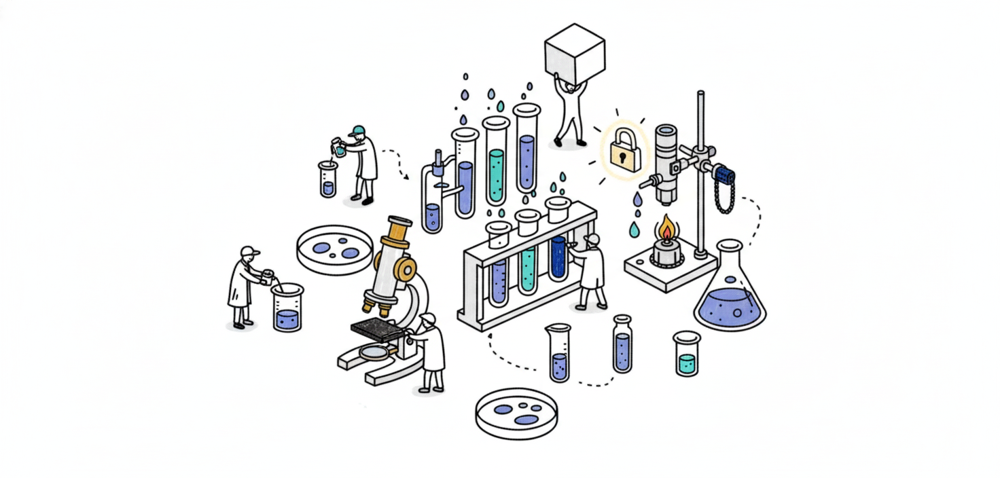

# About Assaybot

> Information for web publishers on Index Exchange's site crawler bot.

Assaybot is Index Exchange's automated content analysis crawler designed to ensure brand safety across our advertising exchange. It uses a multi-stage AI classification pipeline to analyze web page content, detect potential brand safety concerns, and help maintain high-quality inventory standards that protect both advertiser and publisher interests.

### Purpose

Assaybot operates as part of Index Exchange's quality assurance infrastructure. The system:

* Analyzes publisher page content for brand safety compliance using industry-leading AI models
* Identifies potential concerns including adult content, hate speech, violence, CSAM and other material that may affect advertiser confidence
* Helps publishers maintain and grow advertiser demand by ensuring inventory meets brand safety standards
* Operates entirely outside of the ad serving path — it has zero impact on ad delivery latency or page load performance

### How It Benefits Publishers

Brand safety is a shared priority. When advertisers trust the quality of your inventory, it drives stronger demand and better monetization outcomes. Assaybot helps by:

* Proactively identifying content issues before they affect your revenue
* Providing transparent, consistent quality assessments across the Index Exchange
* Reducing the need for manual review processes that can delay issue resolution
* Ensuring your inventory remains eligible for premium advertiser demand

Assaybot does not affect your site's search engine rankings or visibility. It does not index content for public search, and it does not redistribute your content in any form. It is exclusively used for content quality assessment within Index Exchange's advertising ecosystem.

***

_This documentation is maintained by Index Exchange and reflects the current state of the Assaybot system. Publishers will be notified of significant changes to crawl behavior or capabilities._
